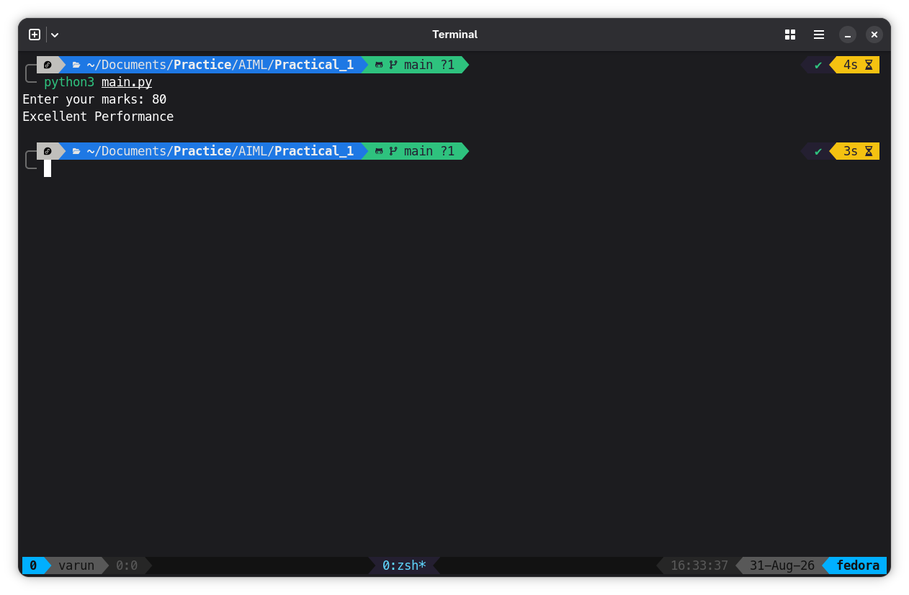

# Program
```python
marks = int(input("Enter your marks: "))

if marks >= 75:
    print("Excellent Performance")
elif marks >= 50:
    print("Good Performance. Keep Improving.")
else:
    print("Needs More Practice.")
```

## Output

