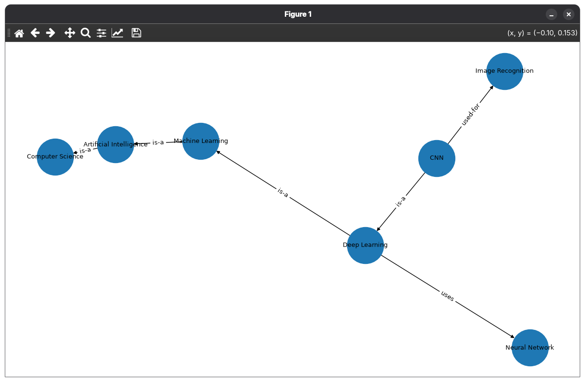
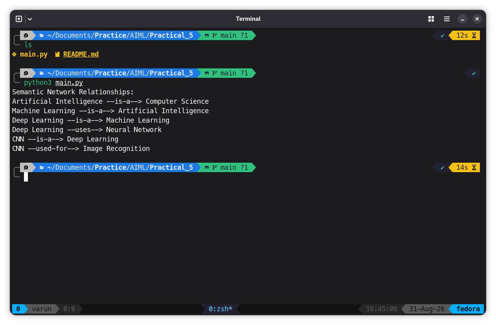

# Program
```python
# Semantic Network for Knowledge Representation
# using Python NetworkX library

import networkx as nx
import matplotlib.pyplot as plt

# Create a directed graph
semantic_network = nx.DiGraph()

# Add objects and concepts
nodes = [
    "Artificial Intelligence",
    "Machine Learning",
    "Deep Learning",
    "CNN",
    "Image Recognition",
    "Computer Science",
    "Neural Network"
]

semantic_network.add_nodes_from(nodes)

# Add relationships
relationships = [
    ("Artificial Intelligence", "Computer Science", "is-a"),
    ("Machine Learning", "Artificial Intelligence", "is-a"),
    ("Deep Learning", "Machine Learning", "is-a"),
    ("Deep Learning", "Neural Network", "uses"),
    ("CNN", "Deep Learning", "is-a"),
    ("CNN", "Image Recognition", "used-for")
]

for source, target, relation in relationships:
    semantic_network.add_edge(source, target, relation=relation)

# Display relationships
print("Semantic Network Relationships:")

for source, target, data in semantic_network.edges(data=True):
    print(f"{source} --{data['relation']}--> {target}")

# Draw the semantic network
plt.figure(figsize=(12, 7))

pos = nx.spring_layout(semantic_network, seed=42)

nx.draw(
    semantic_network,
    pos,
    with_labels=True,
    node_size=3000,
    font_size=9,
    arrows=True
)

# Display relationship labels
edge_labels = nx.get_edge_attributes(
    semantic_network, "relation"
)

nx.draw_networkx_edge_labels(
    semantic_network,
    pos,
    edge_labels=edge_labels,
    font_size=9
)

plt.title("Semantic Network for Knowledge Representation")
plt.axis("off")
plt.show()
```

## Output


