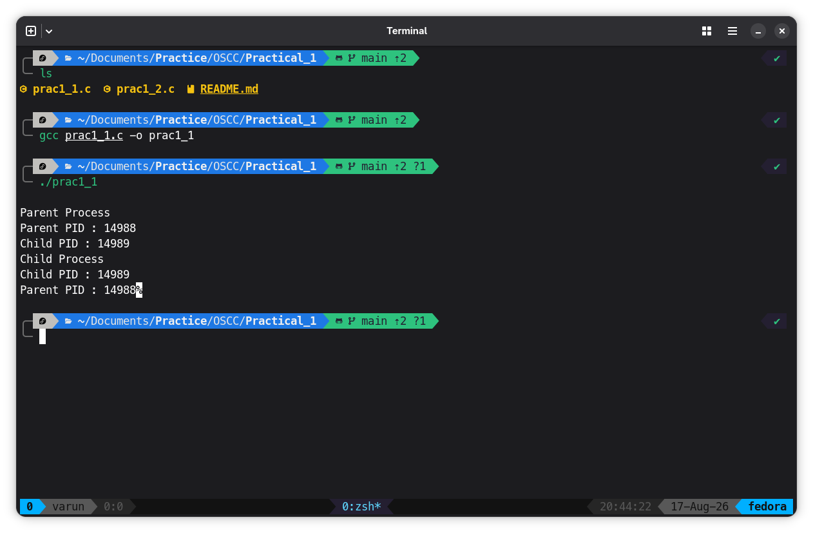
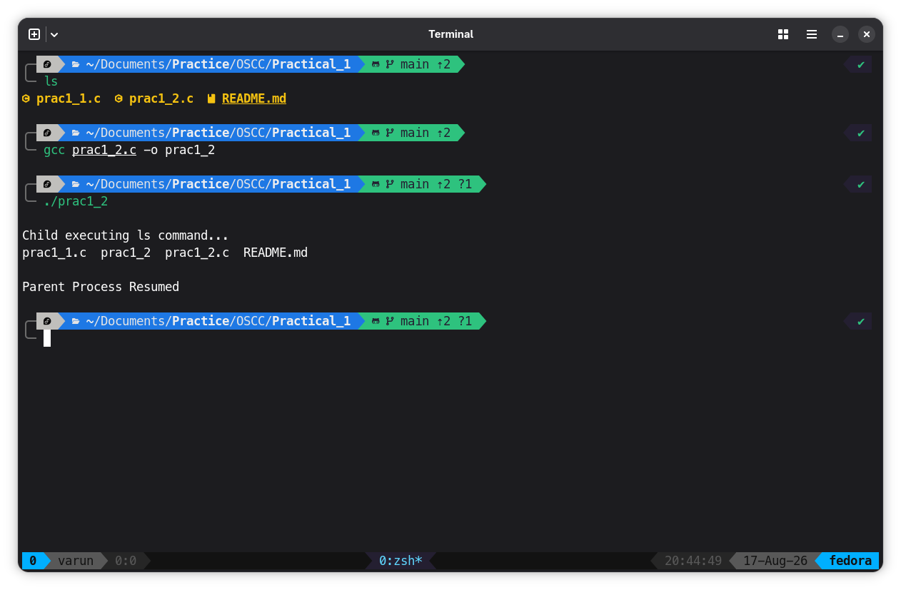

# Program 1

```C
#include <stdio.h>
#include <unistd.h>

int main() {
  pid_t pid;

  pid = fork();

  if (pid == 0) {
    printf("\nChild Process");
    printf("\nChild PID : %d", getpid());
    printf("\nParent PID : %d", getppid());
  } else {
    printf("\nParent Process");
    printf("\nParent PID : %d", getpid());
    printf("\nChild PID : %d", pid);
  }

  return 0;
}
```

## Output


# Program 2
```

#include <stdio.h>
#include <stdlib.h>
#include <sys/wait.h>
#include <unistd.h>

int main() {
  pid_t pid;

  pid = fork();

  if (pid == 0) {
    printf("\nChild executing ls command...\n");

    execl("/bin/ls", "ls", NULL);

    exit(0);
  }

  else {
    wait(NULL);
    printf("\nParent Process Resumed\n");
  }
  return 0;
}
```

## Output

