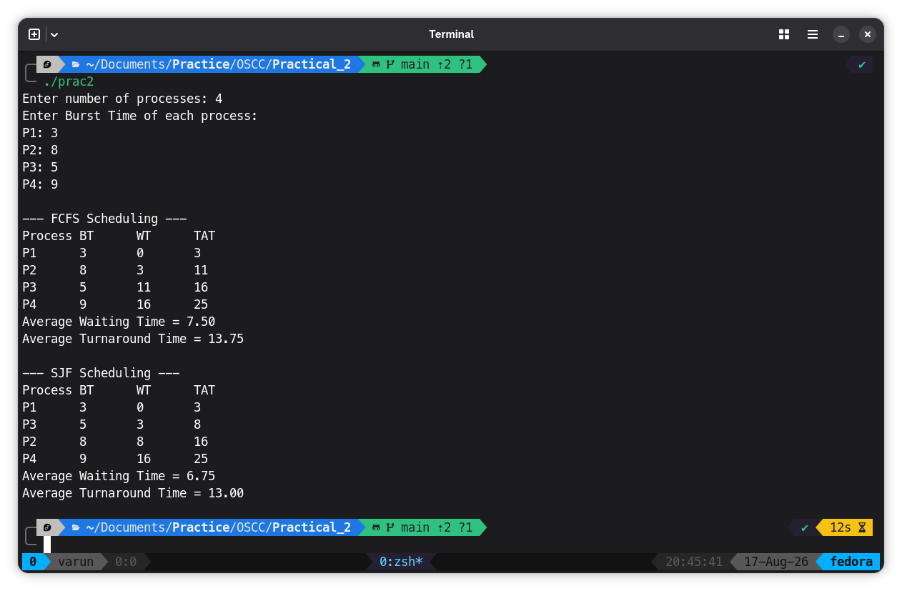

# Program

```
#include <stdio.h>

void fcfs(int n, int bt[]) {
  int wt[10], tat[10];
  float avgwt = 0, avgtat = 0;

  wt[0] = 0;

  for (int i = 1; i < n; i++)
    wt[i] = wt[i - 1] + bt[i - 1];

  printf("\n--- FCFS Scheduling ---\n");
  printf("Process\tBT\tWT\tTAT\n");

  for (int i = 0; i < n; i++) {
    tat[i] = wt[i] + bt[i];

    printf("P%d\t%d\t%d\t%d\n", i + 1, bt[i], wt[i], tat[i]);

    avgwt += wt[i];
    avgtat += tat[i];
  }

  printf("Average Waiting Time = %.2f\n", avgwt / n);
  printf("Average Turnaround Time = %.2f\n", avgtat / n);
}

void sjf(int n, int bt[]) {
  int b[10], p[10], wt[10], tat[10], temp;
  float avgwt = 0, avgtat = 0;

  for (int i = 0; i < n; i++) {
    b[i] = bt[i];
    p[i] = i + 1;
  }

  /* Sort according to burst time */
  for (int i = 0; i < n - 1; i++) {
    for (int j = i + 1; j < n; j++) {
      if (b[i] > b[j]) {
        temp = b[i];
        b[i] = b[j];
        b[j] = temp;

        temp = p[i];
        p[i] = p[j];
        p[j] = temp;
      }
    }
  }

  wt[0] = 0;

  for (int i = 1; i < n; i++)
    wt[i] = wt[i - 1] + b[i - 1];

  printf("\n--- SJF Scheduling ---\n");
  printf("Process\tBT\tWT\tTAT\n");

  for (int i = 0; i < n; i++) {
    tat[i] = wt[i] + b[i];

    printf("P%d\t%d\t%d\t%d\n", p[i], b[i], wt[i], tat[i]);

    avgwt += wt[i];
    avgtat += tat[i];
  }

  printf("Average Waiting Time = %.2f\n", avgwt / n);
  printf("Average Turnaround Time = %.2f\n", avgtat / n);
}

int main() {
  int n, bt[10];

  printf("Enter number of processes: ");
  scanf("%d", &n);

  printf("Enter Burst Time of each process:\n");

  for (int i = 0; i < n; i++) {
    printf("P%d: ", i + 1);
    scanf("%d", &bt[i]);
  }

  fcfs(n, bt);
  sjf(n, bt);

  return 0;
}
```

## Output

