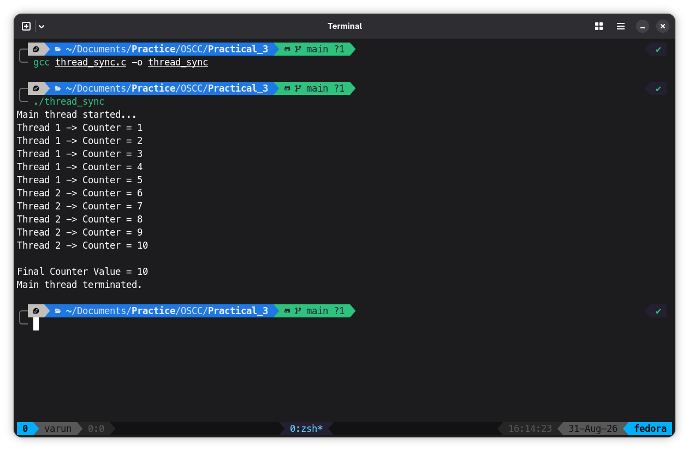

# Program

```C
#include <stdio.h>
#include <stdlib.h>
#include <pthread.h>

int counter = 0;

/* Declare Mutex */
pthread_mutex_t mutex;

/* Function executed by threads */
void *incrementCounter(void *arg)
{
    int thread_no = *((int *)arg);

    for(int i = 0; i < 5; i++)
    {
        /* Lock the critical section */
        pthread_mutex_lock(&mutex);

        counter++;

        printf("Thread %d -> Counter = %d\n",
               thread_no, counter);

        /* Unlock the critical section */
        pthread_mutex_unlock(&mutex);
    }

    pthread_exit(NULL);
}

int main()
{
    pthread_t thread1, thread2;

    int id1 = 1;
    int id2 = 2;

    /* Initialize mutex */
    pthread_mutex_init(&mutex, NULL);

    printf("Main thread started...\n");

    /* Create first thread */
    pthread_create(&thread1,
                   NULL,
                   incrementCounter,
                   &id1);

    /* Create second thread */
    pthread_create(&thread2,
                   NULL,
                   incrementCounter,
                   &id2);

    /* Wait for threads to finish */
    pthread_join(thread1, NULL);
    pthread_join(thread2, NULL);

    printf("\nFinal Counter Value = %d\n", counter);

    /* Destroy mutex */
    pthread_mutex_destroy(&mutex);

    printf("Main thread terminated.\n");

    return 0;
}
```

## Output

